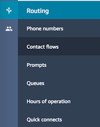

# Fun with Amazon Connect!

- [Overview](#overview)
- [Hands On](#hands-on)
    - [Access AWS URL](#access-aws-url)
    - [Logging in to AWS Console](#logging-in-to-aws-console)
    - [Creating S3 Bucket and upload Lambda Code](#creating-s3-bucket-and-upload-lambda-code)
    - [Configure the Lambda Cloudformation File](#configure-the-lambda-cloudformation-file)
    - [Create the Lamdba Functions using Cloudformation](#create-the-lamdba-functions-using-cloudformation)
    - [Confirm the SNS Subscription](#confirm-the-sns-subscription)
    - [Test the Leave Message Lambda Function](#test-the-leave-message-lambda-function)
    - [Test the Connect Message Sender Lambda Function](#test-the-connect-message-sender-lambda-function)
    - [Configure Amazon Lex JSON](#configure-amazon-lex-json)
    - [Create new Lex ChatBot](#create-new-lex-chatbot)
    - [Test the Lex Bot](#test-the-lex-chatbot)
    - [Publish the Chat Bot](#publish-the-chat-bot)
    - [Add Bot to Amazon Connect Instance](#add-bot-to-amazon-connect-instance)
    - [Create Amazon Connect Flow](#create-amazon-connect-flow)
    - [Configure Contact Flow JSON](#configure-contact-flow-json)
    - [Claim Amazon Connect Phone Number](#claim-amazon-connect-phone-number)
    - [Test your Connect Contact Flow](#test-your-connect-contact-flow)
- [Conclusion](#conclusion)
- [Resources](#resources)
- [Appendix](#appendix)
    - [Setting up the Playground Environment](#setting-up-the-playground-environment)
    - [Tearing down the Playground Environment](#tearing-down-the-playground-environment)

# Overview

Amazon Connect is a self-service, cloud-based contact center service that makes it easy for any business to deliver better customer service at lower cost.

Amazon Connect is based on the same contact center technology used by Amazon customer service associates around the world to power millions of customer conversations.

The self-service graphical interface in Amazon Connect makes it easy for non-technical users to design contact flows, manage agents, and track performance metrics - no specialized skills required.

There are no up-front payments or long-term commitments and no infrastructure to manage with Amazon Connect; customers pay by the minute for Amazon Connect usage plus any associated telephony services.

In this playground we are going to see how easy it is to set up a solution that automates interactive calls using Amazon Connect and AWS Lex then transcribes what was said utilizing AWS Lambda and AWS SNS. And of course CloudFormation to deploy the DevOps way!

# Hands-on
### Access AWS URL

Fill in the following survey to obtain the AWS URL

http://goo.gl/PehmiM

### Logging in to AWS Console

You can skip this section if you are using your own AWS account and have appropriate IAM access (detailed in addendum)

The user that we logged into won't have many permissions at this stage so we need to assume an appropriate role. Follow this link in order to do that:

https://signin.aws.amazon.com/switchrole?roleName=sgpg01meetuprole&account=devops-playground-sg

Just click the "Switch Role" button to continue back to the console

Also switch your region to North Virginia (us-east-1), the default setup assumes this.

You should now see an indicator in the top right showing that you are currently assuming a role.

### Creating S3 Bucket and upload Lambda Code

Navigate to the S3 user interface.

Click the "Create Bucket" Button. 

Enter a Bucket Name. Use your AWS user name to avoid name cashes. E.g. "user1-s3-bucket"
Ensure the region is set to EU (Ireland)
Click "Create".

Click on your bucket name

Click the "Upload" button

Drag LambdaFunctions.zip into the windows and click "Upload"

### Configure the Lambda Cloudformation File

Open LambdaSetup.yaml and at the top and set <PLAYGROUND USER> to your playground username. E.g. "user1"

Set <EMAIL> to the email address that you have access to.

Set <S3 BUCKET> to the name used in the section above. E.g. "user1-s3-bucket"

Set <TOPIC NAME> to a unique name using your playground user name. E.g. "user1-topic"

### Create the Lamdba Functions using Cloudformation

Navigate to the Cloudformation user interface.

Click the "Create Stack" button

Click the "Browse" button and select the "LambdaSetup.yaml" file

Click "Next"

Enter a name for your Cloudformation Stack, user your playground user name as part of the stack name. E.g. "USER1-PLAYGROUND-STACK"
Click "Next".

Review the Cloudformation stack details then click the "Create" button

Confirm that the stack has been completed successfully

### Confirm the SNS Subscription

Check your inbox for an email with the subject "AWS Notification - Subscription Confirmation".
Open the email and click the "Confirm Subscription" link

Check the webpage for a "Subscription Confirmed" message.

### Test the Leave Message Lambda Function

Navigate to the Lambda user interface.

Enter your playground username in the filter and select your "LeaveMessage" Lambda function.

Make a note of the Arn (Amazon Resource Name) for the LeaveMessage lambda function. We will need that for later.

Click the "Test" button

Enter a name for the test event. E.g. "User1LeaveMessageTestEvent"

Copy and paste the contents of lambda/testjson/LeaveMessageTestEvent.json into the popup window.

Click the "Create" button

Click the "Test" button again.

Check the test run succeeded:

Check your inbox for a test email.

### Test the Connect Message Sender Lambda Function

Navigate to the Lambda user interface.

Enter your playground username in the filter and select your "ConnectMessageSender" Lambda function.

Make a note of the Arn (Amazon Resource Name) for the ConnectMessageSender lambda function. We will need that for later.

Click the "Test" button

Enter a name for the test event. E.g. "User1CMSTestEvent"

Copy and paste the contents of lambda/testjson/ConnectMessageSenderTestEvent.json into the popup window.

Click the "Create" button

Click the "Test" button again.

Check the test run succeeded:

Check your inbox for a test email.

### Configure Amazon Lex JSON

Open lex/CallBot.json in a text editor.

Goto Line 8 and set <NAME> to something unique using your user name (letters only). E.g. UserOneLexBot

Save and close CallBot.json

Compress CallBot.json so that it is contained within a .zip file.

### Create new Lex ChatBot

Navigate to the Lex user interface.

If there are no bots are listed you'll see a getting started screen instead so just click "Get started" to get to the next step

Click the "Cancel" on the create bot screen.

Click Actions -> Import

Upload the CallBot zip file created earlier.

Click "Import"

Click "Overwrite and Continue"

Enter your bot name in the filter and select your lex bot.

Underneath the "Editor" tab. Click the "LeaveMessage" intent.

Scrolls down to the "Fulfilment" Section. 

Select the "AWS Lambda function" radio button.

Select your "LeaveMessage" lambda function from the drop down.

A notification may appear requesting access to the Lambda function from Lex. Click "OK"

Click "Save Intent"

Click "Build" 

Await a build confirmation message

### Test the Lex ChatBot

If not already, expand the "Test Chatbot" section.

Type "hello" and answer the questions.

The final message "Thank you, your message has been sent" indicates the conversation is over.

Check your inbox for a mail containing information on the conversation.

### Publish the Chat Bot

Click "Publish"

Set an unique alias name using your playground user name. E.g. "MailBoxUserOne"

Click "Publish"

### Add Bot to Amazon Connect Instance

Navigate to Connect.

Click on the "ecsd-devops-playground" instance

Click on "Contact Flows"

Under the "Amazon Lex" section, select your bot from the dropdown list. E.g. MailboxUserOne

Click "Add Lex Bot"

### Configure Contact Flow JSON

Open connect/LeaveMessageFlow.json in a text editor.

Goto Line 11 and set <FLOW NAME> to something unique using your user name (letters only). E.g. UserOneContactFlow

### Create Amazon Connect Flow

Follow the link to the Connect user interface. 

https://devops-playground-sg.awsapps.com/connect/login 

(This connect instance has been setup for the playground. You can easily set one up be navigating to Connect under the AWS console.)

Login using the crentials provided to you.

Navigate to the Contact Flows section

Click "Create Contact Flow"

Select "Import Flow"

Upload the connect/LeaveMessage/Flow file and click "Import"

Click "Get customer input"

Under the "Lex bot" section of "Get Customer Input" select your Lex Bot from the dropdown list. Eg. MailBoxUserOne

Click "Save"

Click "Invoke Lambda Function"

Paste the Arn to the "Connect Message Sender" lambda function obtained earlier. Click "Save"

Click "Save and Publish" at the top of the page and confirm the change.

### Claim Amazon Connect Phone Number

On the Connect dashboard, click "Begin" (If a phone number has already been claimed, select "View Numbers" then "Claim a number" )

Select "DID (Direct Inward Dialing)"

Select a country.

Choose a number.

Enter your user name as the descritpion

Select your contact flow from the dropdown

Click "Save"

### Test your Connect Contact Flow

Click on the phone icon

Click on "Dial Number"

Enter the number that you claimed earlier. Press "Dial"

Listen to the call and answer the questions

Check your inbox for an email.

# Conclusion

So now we have set something up where we can call a number, have a conversation with a bot and have that conversation transcribed and sent to a response team. No infrastructure to manage, all serverless!

We have barely scratched the service of what these Amazon services can offer, the possibilites are endless.

Other additions we can make include a DynamoDB backend to presreve call status, real-time metrics and reporting on calls in queue / answered calls / lost calls / average call length, automated actions etc.

We hope this playground has helped provide you with a better understanding of the AWS services we have covered and given you the platform to further explore.

# Resources

### Connect

Product Details
https://aws.amazon.com/connect/details/

Documentation
https://docs.aws.amazon.com/connect/latest/userguide/using-amazon-connect.html

### Lex

Product Details
https://aws.amazon.com/lex/details/

Documentation
https://docs.aws.amazon.com/lex/latest/dg/what-is.html

### Lambda

Product Details
https://aws.amazon.com/lambda/features/

Documentation
https://docs.aws.amazon.com/lambda/latest/dg/welcome.html

### CloudFormation

Product Details
https://aws.amazon.com/cloudformation/details/

Documentation
https://docs.aws.amazon.com/AWSCloudFormation/latest/UserGuide/Welcome.html

### SNS

Product Details
https://aws.amazon.com/sns/details/

Documentation
https://docs.aws.amazon.com/sns/latest/dg/welcome.html 

### S3

Product Deatails
https://aws.amazon.com/s3/features/

Documentation
https://docs.aws.amazon.com/AmazonS3/latest/user-guide/what-is-s3.html

# Appendix

### Setting up the Playground Environment

In this section we'll go through the steps required to setup the playground environment. Useful if you wish to share this playground with others.

On a Linux machine that has openssl installed, execute _setup/prepare.sh

On the command prompt, type in the number of playground users, and hit enter.

Monitor the output, as it will display the user and password for each user to log into AWS.

A user with Admin access in AWS is required to perform the following steps. 

****** IT IS RECCOMMENDED YOU CREATE THE PLAYGROUND ENVIRONMENT IN A SEPARTE AWS ACCOUNT. *******

Navigate to Cloudformation. Ensure you are under the EU Ireland (eu-west-1) region.

Upload _setup/IAMSetup_Cloudformation.yaml. Click Next

Enter a stack name, E.g. "PLAYGROUND-IAM", click next

Click next on the "Options" page

On the "Review" page, ensure that the IAM check box is selected, click "Create"

Confirm the stack created successfully.

Navigate to Amazon Connect. Ensure you are under the North Virginia (us-east-1) region.

Click the "Get Started" button (this will appear if there are no Connect instances configured).

Ensure "Store users within Amazon COnnect" radion button is selected.

Enter an alias for the Connect instance. E.g. "ecsd-devops-playground". Click "Next Step"

Enter details for an administrator account. Click "Next Step"

Under the "Telephony Options" page, ensure both check boxes are selected. Click "Next Step"

Make a note of the "Data Storage" settings and click "Next Step"

Review your Connect instance details. Click "Create Instance"

Click "Get Started". Once inside Connect, navigate to Users - User Management

Click "Add New Users"

Select "Upload my users from a template (csv)." Click "next"

Upload _setup/AMAZON_CONNECT_USERS.csv. Click "Upload and verify"

Validate the file uploaded successfully. Click "Create Users"

Distribute one username and password from the output of _setup/prepare.sh to each playground member.

### Tearing down the Playground Environment

In this section we'll go through the steps required to removing everything from the playground session.

A user with Admin access in AWS is required to perform the following steps.

Navigate to Amazon Connect.

Select your Connect instance and click "Remove"

Enter the name of the Connect instance and click "Remove"

Navigate to Cloudformation. Ensure you are under the EU Ireland (eu-west-1) region.

Select your IAM stack. E.g. "PLAYGROUND-IAM" and Select "Actions -> Delete Stack"

In the pop up, click "Yes, Delete"

***********************************   WARNING   ********************************************

EXECUTING THE FOLLOWING SCRIPT WILL REMOVE ALL S3 BUCKETS, LAMBDA FUNCTIONS, SNS TOPICS, 

CLOUDFORMATION STACK UNDER THE N. VIRGINIA REGION, AND ALL LEX BOTS ACROSS ALL REGIONS.

DO NOT RUN THIS SCRIPT IF YOU USE YOUR AWS ACCOUNT FOR PURPOSES OTHER THAN THIS PLAYGROUND

***********************************   WARNING   ********************************************

On a Linux machine that has awscli and jq installed, ensure ACCESS KEY ID and SECRET ACCESS KEY for an admin is configured.

execute _teardown/cleanup_playground.sh

Read the warning and answer appropriately.